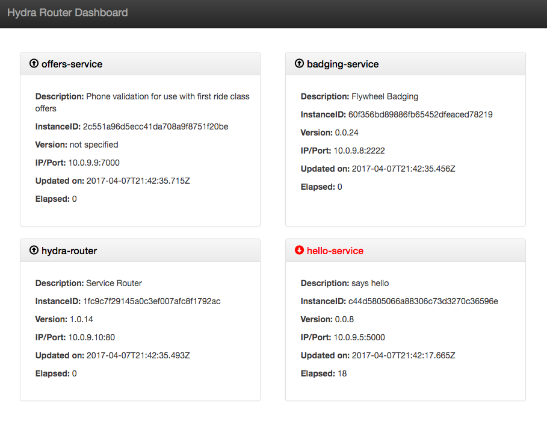

Hydra Router is a service-aware HTTP, WebSocket and messaging gateway. It was announced at EmpireNode 2016.

HTTP and WebSocket clients can connect to Hydra Router to send messages to Hydra-based microservices. Additionally, microservices can send messages through Hydra Router back to WebSocket connected clients.

A cluster of Hydra Routers can work together to ensure that messages from microservices can be routed back to connected clients.

Hydra Router is built using the Hydra library. If you'd like to learn more about Hydra visit the [github repo](https://github.com/pnxtech/hydra) for a list of articles and videos.

```diff
- HydraRouter version 1.9.0 includes a breaking change. The fwsp-logger is no longer a supported logging plugin due to lack of ongoing support.
- You can use HydraRouter versions 1.8.0 < 1.9.0 if you require fwsp-logger support.
```

### Running locally

HydraRouter requires access to an instance of Redis. You can place the connection info inside of the ./config/config.json file. If you don't have a config.json file you can simply copy the existing sample-config.json to config.json.

An important point is that as configured the location of Redis is set to `redis://host:6379/15` You'll need a DNS entry to point host to the ip address where Redis is located or simply replace the host string to another entry.

The provided sample-config.json file is sets Hydra-router to use port 80. You'll need to use sudo to launch HydraRouter or change the port to an available port number above 1024.

### Full documentation

See the full dcumentation at [https://www.hydramicroservice.com/docs/tools/hydra-router/](https://www.hydramicroservice.com/docs/tools/hydra-router/)

### Hydra Router Dashboard

Hydra Router hosts a dashboard showing running microservices.



### Docker Images

You can build and run Hydra-router from source or pull a pre-built Docker image

* Release 1.7.0 and newer : [pnxtech/hydra-router](https://hub.docker.com/r/pnxtech/hydra-router/tags/)
* Release 1.7.0 and earlier : [flywheelsports/hydra-router](https://hub.docker.com/r/flywheelsports/hydra-router/tags/)


